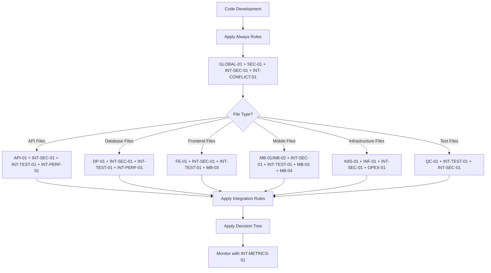
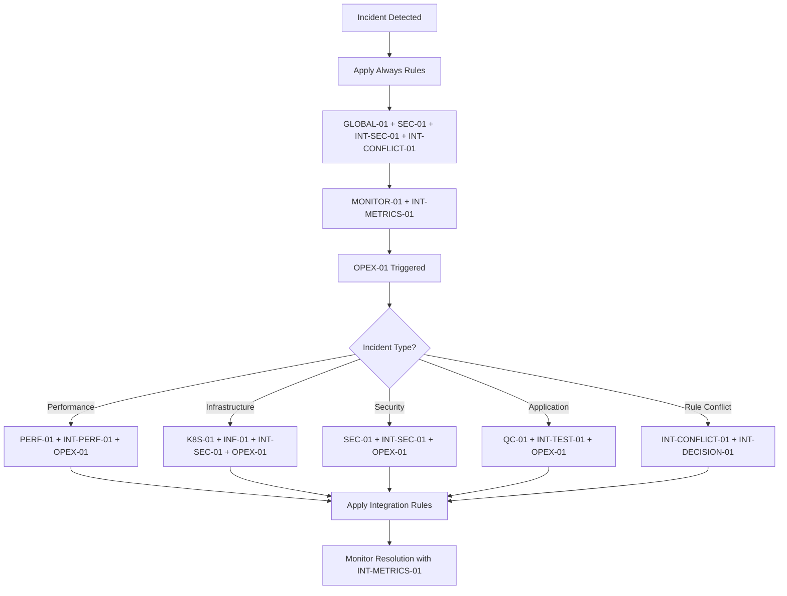
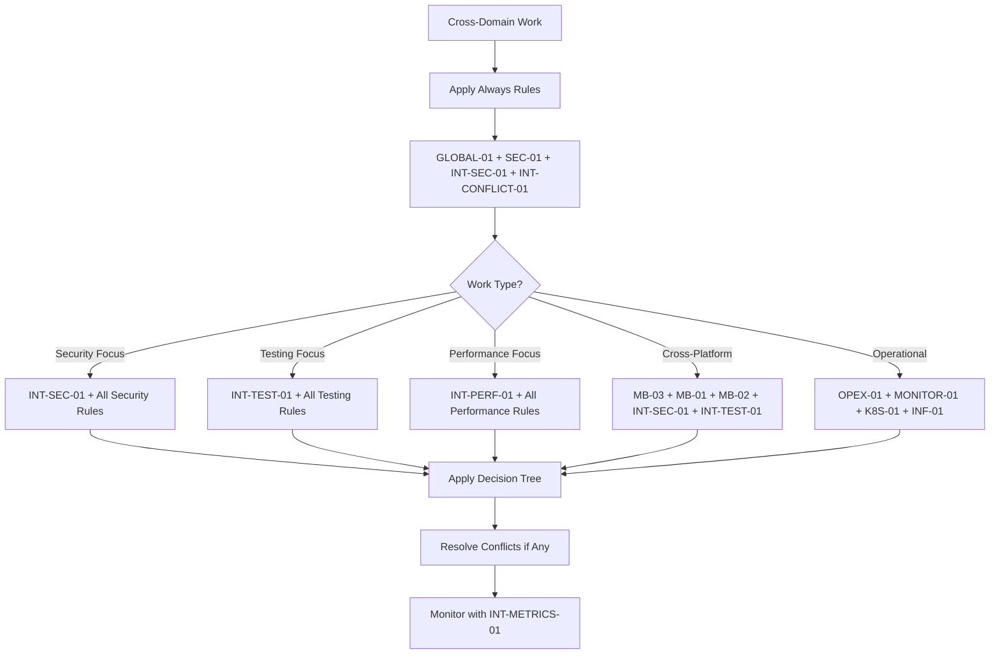

# Rule Dependency Matrix

## Overview

This document provides a comprehensive mapping of rule dependencies, triggers, and integration points across the entire rule base. It shows how rules reference each other and when manual rules should be triggered.

## Rule Signal System

### Embedded Rule Signals
Rule application signals are now embedded within the `.mdc` rule files themselves, creating a chain of rule references:

- **GLOBAL-01** → Contains signals for all development work types
- **INT-SEC-01** → Contains signals for security-related work
- **INT-TEST-01** → Contains signals for testing-related work
- **INT-CONFLICT-01** → Contains signals for rule conflict resolution
- **Domain Rules** → Each domain rule contains signals for related work types

### Rule Signal Chain
```
GLOBAL-01 (global-rule.mdc)
├── API Development → API-01 + INT-SEC-01 + INT-TEST-01 + INT-PERF-01
├── Database Work → DP-01 + INT-SEC-01 + INT-TEST-01 + INT-PERF-01
├── Frontend Work → FE-01 + INT-SEC-01 + INT-TEST-01 + MB-03
├── Mobile Work → MB-01/MB-02 + INT-SEC-01 + INT-TEST-01 + MB-03 + MB-04
├── Infrastructure Work → K8S-01/INF-01 + INT-SEC-01 + OPEX-01
├── Testing Work → QC-01 + INT-TEST-01 + INT-SEC-01
├── Writing Work → QC-17 + QC-14 (PRIMARY documentation authority)
└── Unclear Situations → QC-16 + QC-13

INT-SEC-01 (security-integration.mdc)
├── API Security → API-01 + INT-TEST-01 + INT-PERF-01
├── Database Security → DP-01 + INT-TEST-01 + INT-PERF-01
├── Frontend Security → FE-01 + INT-TEST-01 + MB-03
├── Mobile Security → MB-01/MB-02 + INT-TEST-01 + MB-03 + MB-04
└── Infrastructure Security → K8S-01/INF-01 + OPEX-01

INT-TEST-01 (testing-integration.mdc)
├── API Testing → API-01 + INT-SEC-01 + INT-PERF-01
├── Database Testing → DP-01 + INT-SEC-01 + INT-PERF-01
├── Frontend Testing → FE-01 + INT-SEC-01 + MB-03
├── Mobile Testing → MB-01/MB-02 + INT-SEC-01 + MB-03 + MB-04
└── Infrastructure Testing → K8S-01/INF-01 + OPEX-01

INT-PERF-01 (performance-integration.mdc)
├── API Performance → API-01 + INT-SEC-01 + INT-TEST-01
├── Database Performance → DP-01 + INT-SEC-01 + INT-TEST-01
├── Frontend Performance → FE-01 + INT-SEC-01 + MB-03
├── Mobile Performance → MB-01/MB-02 + INT-SEC-01 + MB-03 + MB-04
└── Infrastructure Performance → K8S-01/INF-01 + OPEX-01

INT-CONFLICT-01 (rule-conflict-resolution.mdc)
├── Security Conflicts → INT-SEC-01 + INT-DECISION-01
├── Testing Conflicts → INT-TEST-01 + INT-DECISION-01
├── Performance Conflicts → INT-PERF-01 + INT-DECISION-01
└── Project Management Conflicts → QC-13 + INT-DECISION-01

INT-DECISION-01 (rule-application-decision-tree.mdc)
├── Rule Conflicts → INT-CONFLICT-01 + INT-SEC-01
├── Security Decisions → INT-SEC-01 + INT-TEST-01
├── Testing Decisions → INT-TEST-01 + INT-PERF-01
└── Performance Decisions → INT-PERF-01 + INT-METRICS-01

INT-METRICS-01 (rule-effectiveness-metrics.mdc)
├── Rule Effectiveness → INT-DECISION-01 + INT-CONFLICT-01
├── Security Metrics → INT-SEC-01 + INT-TEST-01
├── Testing Metrics → INT-TEST-01 + INT-PERF-01
└── Performance Metrics → INT-PERF-01 + INT-PERF-MON-01

QC-16 (no-assumptions-rule.mdc)
├── Technical Clarification → QC-13 + QC-14
├── Process Clarification → QC-06 + QC-13
└── Security Clarification → INT-SEC-01 + QC-13

QC-17 (human-like-writing-standards.mdc)
├── Documentation Writing → QC-14 (PRIMARY documentation authority)
├── Technical Writing → QC-08 + QC-13
└── Content Creation → QC-14 (PRIMARY documentation authority)
```

## Rule Activation Prompts

### Short Version Prompt
**File**: `.cursor/prompts/complete_rule_system_activation_prompt_short_version.md`
**Purpose**: Quick reference for immediate rule activation
**Usage**: Use this for initial rule activation and quick reference

### Complete Version Prompt
**File**: `.cursor/prompts/complete_rule_system_activation_prompt.md`
**Purpose**: Comprehensive rule system documentation with full details
**Usage**: Use this for complete understanding and detailed rule application

## Rule Categories

### Always Apply Rules (20 rules)
- **GLOBAL-01**: Comprehensive Rule Reading Protocol
- **QC-13**: AI Assistant Communication Protocol  
- **QC-14**: Document Synchronization & Cross-Reference Management
- **QC-14**: Document Synchronization & Cross-Reference Management (PRIMARY documentation authority - QC-07, QC-15, QC-14-FEATURE consolidated)
- **QC-16**: No Assumptions Rule
- **QC-17**: Human-Like Writing Standards
- **QC-18**: PM Tool Usage Standards
- **QC-08**: File Organization Standards
- **QC-06**: Project Management & Governance Standards
- **QC-01**: Comprehensive Testing Standards (90% coverage minimum)
- **TEST-01**: Testing Standards (90% coverage minimum)
- **PYTHON-STRUCTURE-01**: Python Package Structure Standards (mandatory src/ layout)
- **SEC-01**: Universal Security Standards
- **GIT-01**: Git Branching Strategy
- **OPEX-02**: Deployment Progression Standards
- **INT-SEC-01**: Security Integration Standards
- **INT-CONFLICT-01**: Rule Conflict Resolution Standards
- **INT-VERSION-01**: Rule Versioning and Compatibility Standards
- **INT-IMPACT-01**: Rule Impact Analysis Tools and Framework
- **INT-PERF-MON-01**: Rule Performance Monitoring and Optimization
- **INT-LEARN-01**: Rule Learning System and Usage Pattern Analysis

### Apply Intelligently Rules (12 rules)
- **API-01**: API Development Standards
- **DP-01**: Database Standards
- **FE-01**: Frontend Development Standards
- **QC-01**: Comprehensive Testing Standards
- **ENG-01**: Engineering Excellence Standards
- **BUG-01**: Bug Reporting Standards
- **K8S-01**: Kubernetes Standards
- **DOCKER-01**: Docker Container Standards
- **MONITOR-01**: Monitoring & Observability
- **PERF-01**: Performance Standards
- **INF-01**: Infrastructure Standards
- **OPEX-01**: Operational Excellence Standards

### Agent Requested Rules (4 rules)
- **MICRO-01**: Microservices Governance
- **CICD-01**: CI/CD Deployment Standards
- **MB-01**: iOS Development Standards
- **MB-02**: Android Development Standards

### Manual Rules (3 rules)
- **MB-03**: Cross-Platform Consistency
- **MB-04**: Mobile Testing Standards
- **OPEX-01**: Operational Excellence

### Integration Rules (4 rules)
- **INT-SEC-01**: Security Integration Standards
- **INT-TEST-01**: Testing Integration Standards
- **INT-PERF-01**: Performance Integration Standards
- **INT-CONFLICT-01**: Rule Conflict Resolution Standards

### Decision & Metrics Rules (2 rules)
- **INT-DECISION-01**: Rule Application Decision Tree
- **INT-METRICS-01**: Rule Effectiveness Metrics and Monitoring

### Long-term Integration Rules (4 rules)
- **INT-VERSION-01**: Rule Versioning and Compatibility Standards
- **INT-IMPACT-01**: Rule Impact Analysis Tools and Framework
- **INT-PERF-MON-01**: Rule Performance Monitoring and Optimization
- **INT-LEARN-01**: Rule Learning System and Usage Pattern Analysis

## Dependency Matrix

### Security Integration (SEC-01)

| Rule | Integration Type | Trigger Conditions | Requirements |
|------|------------------|-------------------|--------------|
| **API-01** | Dependencies | API development | JWT validation, rate limiting, input sanitization, HTTPS |
| **DP-01** | Dependencies | Database operations | Data encryption, access control, SQL injection prevention |
| **FE-01** | Dependencies | Frontend development | XSS prevention, CSRF protection, secure auth flows |
| **MB-01** | Triggers | iOS security features | Keychain usage, biometric auth, data encryption |
| **MB-02** | Triggers | Android security features | Keystore usage, biometric auth, data encryption |

### Testing Integration (QC-01)

| Rule | Integration Type | Trigger Conditions | Requirements |
|------|------------------|-------------------|--------------|
| **API-01** | Dependencies | API testing | Unit tests, integration tests, E2E tests, performance tests |
| **FE-01** | Dependencies | Frontend testing | Component tests, integration tests, E2E tests, visual regression |
| **DP-01** | Dependencies | Database testing | Unit tests, migration tests, data integrity tests |
| **MB-01** | Triggers | iOS testing | Mobile-specific testing requirements |
| **MB-02** | Triggers | Android testing | Mobile-specific testing requirements |
| **MB-04** | Manual Trigger | Mobile testing | iOS/Android testing standards |

### Performance Integration (PERF-01)

| Rule | Integration Type | Trigger Conditions | Requirements |
|------|------------------|-------------------|--------------|
| **API-01** | Dependencies | API performance | Response optimization, caching, query optimization |
| **DP-01** | Dependencies | Database performance | Query optimization, indexing, connection pooling |
| **K8S-01** | Triggers | K8s resource config | Resource limits, auto-scaling, performance optimization |
| **MONITOR-01** | Triggers | Performance monitoring | Metrics collection, SLA monitoring, alerting |

### Cross-Platform Integration (MB-03)

| Rule | Integration Type | Trigger Conditions | Requirements |
|------|------------------|-------------------|--------------|
| **FE-01** | Triggers | UI components with mobile targets | Platform-specific requirements, consistent UX |
| **MB-01** | Triggers | iOS cross-platform features | Shared business logic, API integration, UI consistency |
| **MB-02** | Triggers | Android cross-platform features | Shared business logic, API integration, UI consistency |

### Operational Excellence Integration (OPEX-01)

| Rule | Integration Type | Trigger Conditions | Requirements |
|------|------------------|-------------------|--------------|
| **PERF-01** | Triggers | Performance issues detected | Operational procedures for performance issues |
| **MONITOR-01** | Triggers | Monitoring alerts triggered | Incident response procedures |
| **K8S-01** | Triggers | K8s deployments | Operational procedures for deployments |

### Mobile Testing Integration (MB-04)

| Rule | Integration Type | Trigger Conditions | Requirements |
|------|------------------|-------------------|--------------|
| **QC-01** | Triggers | Mobile application testing | Mobile-specific testing patterns |
| **MB-01** | Triggers | iOS feature development | iOS testing requirements |
| **MB-02** | Triggers | Android feature development | Android testing requirements |

### Security Integration (INT-SEC-01)

| Rule | Integration Type | Trigger Conditions | Requirements |
|------|------------------|-------------------|--------------|
| **API-01** | Dependencies | API development | Authentication, authorization, input validation, secure communication |
| **DP-01** | Dependencies | Database operations | Data encryption, access control, SQL injection prevention |
| **FE-01** | Dependencies | Frontend development | XSS prevention, CSRF protection, secure auth flows |
| **MB-01** | Dependencies | iOS development | Keychain usage, biometric auth, data encryption |
| **MB-02** | Dependencies | Android development | Keystore usage, biometric auth, data encryption |
| **K8S-01** | Dependencies | Kubernetes deployments | Pod security, network policies, secrets management |
| **INF-01** | Dependencies | Infrastructure code | Security hardening, compliance, monitoring |

### Testing Integration (INT-TEST-01)

| Rule | Integration Type | Trigger Conditions | Requirements |
|------|------------------|-------------------|--------------|
| **API-01** | Dependencies | API testing | Unit tests, integration tests, E2E tests, performance tests |
| **DP-01** | Dependencies | Database testing | Schema tests, query tests, data integrity tests |
| **FE-01** | Dependencies | Frontend testing | Component tests, integration tests, E2E tests, visual regression |
| **MB-01** | Dependencies | iOS testing | Unit tests, UI tests, device tests, performance tests |
| **MB-02** | Dependencies | Android testing | Unit tests, UI tests, device tests, performance tests |
| **K8S-01** | Dependencies | Infrastructure testing | Configuration tests, deployment tests, scaling tests |
| **PERF-01** | Dependencies | Performance testing | Load tests, stress tests, endurance tests, volume tests |

### Performance Integration (INT-PERF-01)

| Rule | Integration Type | Trigger Conditions | Requirements |
|------|------------------|-------------------|--------------|
| **API-01** | Dependencies | API performance | Response optimization, caching, query optimization |
| **DP-01** | Dependencies | Database performance | Query optimization, indexing, connection pooling |
| **FE-01** | Dependencies | Frontend performance | Code splitting, caching, rendering optimization |
| **MB-01** | Dependencies | iOS performance | App startup, memory management, UI performance |
| **MB-02** | Dependencies | Android performance | App startup, memory management, UI performance |
| **K8S-01** | Dependencies | Infrastructure performance | Container optimization, networking, storage |
| **MONITOR-01** | Dependencies | Performance monitoring | Metrics collection, alerting, performance analysis |

### Conflict Resolution Integration (INT-CONFLICT-01)

| Rule | Integration Type | Trigger Conditions | Requirements |
|------|------------------|-------------------|--------------|
| **GLOBAL-01** | Dependencies | All rule applications | Systematic rule analysis and conflict detection |
| **INT-SEC-01** | Dependencies | Security conflicts | Security-first conflict resolution principles |
| **INT-TEST-01** | Dependencies | Testing conflicts | Testing requirements in conflict resolution |
| **INT-PERF-01** | Dependencies | Performance conflicts | Performance considerations in conflict resolution |
| **QC-13** | Dependencies | Project management conflicts | Project context in conflict resolution decisions |

### Decision Tree Integration (INT-DECISION-01)

| Rule | Integration Type | Trigger Conditions | Requirements |
|------|------------------|-------------------|--------------|
| **GLOBAL-01** | Dependencies | All rule applications | Foundation for all rule application decisions |
| **INT-CONFLICT-01** | Dependencies | Rule conflicts | Conflict resolution in rule application decisions |
| **INT-SEC-01** | Dependencies | Security contexts | Security considerations in rule application |
| **INT-TEST-01** | Dependencies | Testing contexts | Testing requirements in rule application |
| **INT-PERF-01** | Dependencies | Performance contexts | Performance considerations in rule application |

### Metrics Integration (INT-METRICS-01)

| Rule | Integration Type | Trigger Conditions | Requirements |
|------|------------------|-------------------|--------------|
| **GLOBAL-01** | Dependencies | All rule applications | Foundation for all rule effectiveness measurement |
| **INT-CONFLICT-01** | Dependencies | Conflict resolution | Conflict resolution effectiveness measurement |
| **INT-DECISION-01** | Dependencies | Decision making | Decision tree effectiveness measurement |
| **QC-13** | Dependencies | Project management | Project management effectiveness measurement |
| **MONITOR-01** | Dependencies | Monitoring systems | Monitoring and observability effectiveness measurement |

### Versioning Integration (INT-VERSION-01)

| Rule | Integration Type | Trigger Conditions | Requirements |
|------|------------------|-------------------|--------------|
| **GLOBAL-01** | Dependencies | All rule applications | Foundation for all rule versioning and compatibility |
| **INT-CONFLICT-01** | Dependencies | Rule conflicts | Conflict resolution in rule versioning and migration |
| **INT-DECISION-01** | Dependencies | Rule decisions | Decision tree updates and version compatibility |
| **INT-METRICS-01** | Dependencies | Rule metrics | Metrics for rule versioning and performance monitoring |
| **QC-13** | Dependencies | Project management | Project management for rule versioning and migration |

### Impact Analysis Integration (INT-IMPACT-01)

| Rule | Integration Type | Trigger Conditions | Requirements |
|------|------------------|-------------------|--------------|
| **GLOBAL-01** | Dependencies | All rule applications | Foundation for all rule impact analysis |
| **INT-VERSION-01** | Dependencies | Rule versioning | Versioning and compatibility analysis |
| **INT-CONFLICT-01** | Dependencies | Rule conflicts | Conflict analysis and resolution |
| **INT-METRICS-01** | Dependencies | Rule metrics | Metrics collection and analysis for impact assessment |
| **INT-DECISION-01** | Dependencies | Rule decisions | Decision tree impact analysis |

### Performance Monitoring Integration (INT-PERF-MON-01)

| Rule | Integration Type | Trigger Conditions | Requirements |
|------|------------------|-------------------|--------------|
| **GLOBAL-01** | Dependencies | All rule applications | Foundation for all rule performance monitoring |
| **INT-VERSION-01** | Dependencies | Rule versioning | Performance monitoring for rule versioning and compatibility |
| **INT-IMPACT-01** | Dependencies | Rule impact | Performance impact analysis and monitoring |
| **INT-METRICS-01** | Dependencies | Rule metrics | Performance metrics collection and analysis |
| **INT-PERF-01** | Dependencies | Performance rules | Performance standards and optimization |

### Learning System Integration (INT-LEARN-01)

| Rule | Integration Type | Trigger Conditions | Requirements |
|------|------------------|-------------------|--------------|
| **GLOBAL-01** | Dependencies | All rule applications | Foundation for all rule learning and adaptation |
| **INT-PERF-MON-01** | Dependencies | Performance monitoring | Performance data for learning and optimization |
| **INT-METRICS-01** | Dependencies | Rule metrics | Effectiveness metrics for learning and improvement |
| **INT-IMPACT-01** | Dependencies | Rule impact | Impact analysis for learning and optimization |
| **INT-VERSION-01** | Dependencies | Rule versioning | Versioning and compatibility for learning and adaptation |

## Rule Trigger Flow

### Development Workflow Triggers



### Incident Response Triggers



### Integration Workflow Triggers



## Manual Rule Activation Signals

### When to Trigger Manual Rules

| Manual Rule | Trigger Signal | Source Rule | Condition |
|-------------|----------------|-------------|-----------|
| **MB-03: Cross-Platform Consistency** | Cross-platform work | FE-01, MB-01, MB-02 | Multi-platform development |
| **MB-04: Mobile Testing** | Mobile testing needed | QC-01, MB-01, MB-02 | Testing mobile applications |
| **OPEX-01: Operational Excellence** | Incident/performance issues | PERF-01, MONITOR-01, K8S-01 | Operational procedures needed |

### When to Apply Integration Rules

| Integration Rule | Trigger Signal | Source Rule | Condition |
|------------------|----------------|-------------|-----------|
| **INT-SEC-01: Security Integration** | Security-sensitive work | All rules | Any security-related development |
| **INT-TEST-01: Testing Integration** | Testing work | QC-01, All domain rules | Any testing-related development |
| **INT-PERF-01: Performance Integration** | Performance-critical work | PERF-01, All domain rules | Any performance-related development |
| **INT-CONFLICT-01: Conflict Resolution** | Rule conflicts detected | GLOBAL-01, All rules | When rules have conflicting requirements |
| **INT-DECISION-01: Decision Tree** | Rule application decisions | GLOBAL-01, All rules | When determining which rules to apply |
| **INT-METRICS-01: Effectiveness Metrics** | Rule effectiveness monitoring | All rules | Continuous monitoring of rule effectiveness |

### When to Apply Long-term Integration Rules

| Long-term Integration Rule | Trigger Signal | Source Rule | Condition |
|---------------------------|----------------|-------------|-----------|
| **INT-VERSION-01: Versioning & Compatibility** | Rule changes/updates | GLOBAL-01, All rules | When rules are modified or updated |
| **INT-IMPACT-01: Impact Analysis** | Rule change analysis | GLOBAL-01, All rules | When analyzing rule change impacts |
| **INT-PERF-MON-01: Performance Monitoring** | Performance monitoring | All rules | Continuous performance monitoring |
| **INT-LEARN-01: Learning System** | Usage pattern analysis | All rules | Continuous learning from usage patterns |


## Rule Conflict Resolution

### Priority Order
1. **Security Rules** (SEC-01, INT-SEC-01) - Highest priority
2. **Core Rules** (GLOBAL-01, QC-*, GIT-01) - Always apply
3. **Integration Rules** (INT-CONFLICT-01, INT-DECISION-01, INT-METRICS-01) - Always apply
4. **Architecture Rules** (API-01, DP-01, FE-01) - Apply intelligently
5. **Platform Rules** (MB-*, K8S-01, INF-01) - Apply based on context
6. **Operational Rules** (OPEX-01, MONITOR-01) - Manual/triggered
7. **Specialized Integration Rules** (INT-TEST-01, INT-PERF-01) - Apply based on context

### Conflict Resolution Process
1. **Identify conflicting requirements**
2. **Check rule priority order**
3. **Apply highest priority rule**
4. **Document resolution decision**
5. **Update rule if necessary**

## Integration Checklist

### For Each Rule Implementation
- [ ] **Dependencies defined** - Related rules identified
- [ ] **Triggers configured** - Manual rules have trigger signals
- [ ] **Globs optimized** - File patterns are specific and relevant
- [ ] **Cross-references added** - Related rules reference each other
- [ ] **Conflict resolution** - Priority order established
- [ ] **Integration rules applied** - Cross-cutting concerns addressed
- [ ] **Decision tree integration** - Rule application logic defined
- [ ] **Metrics tracking** - Effectiveness measurement configured
- [ ] **Prompt integration** - Rule application signals defined
- [ ] **Documentation updated** - Integration points documented

## Maintenance Guidelines

### Regular Review Schedule
- **Weekly**: Check trigger effectiveness and metrics
- **Monthly**: Review dependency accuracy and integration rules
- **Quarterly**: Update integration patterns and decision tree
- **Annually**: Complete rule base audit and effectiveness analysis

### Update Triggers
- **New rules added** → Update dependency matrix and integration rules
- **Rule modified** → Check all dependent rules and integration points
- **Integration issues** → Update trigger conditions and decision tree
- **Performance problems** → Optimize glob patterns and metrics
- **Conflict resolution** → Update conflict resolution procedures
- **Effectiveness issues** → Update metrics and monitoring

## Summary of Integration Rules

### Cross-Cutting Integration Rules
- **INT-SEC-01**: Security Integration Standards - Ensures security standards across all domains
- **INT-TEST-01**: Testing Integration Standards - Provides comprehensive testing framework
- **INT-PERF-01**: Performance Integration Standards - Optimizes performance across all domains
- **INT-CONFLICT-01**: Rule Conflict Resolution Standards - Resolves conflicts between rules

### Decision and Metrics Rules
- **INT-DECISION-01**: Rule Application Decision Tree - Guides rule application decisions
- **INT-METRICS-01**: Rule Effectiveness Metrics and Monitoring - Measures rule effectiveness

### Long-term Integration Rules
- **INT-VERSION-01**: Rule Versioning and Compatibility Standards - Manages rule evolution and compatibility
- **INT-IMPACT-01**: Rule Impact Analysis Tools and Framework - Analyzes rule change impacts
- **INT-PERF-MON-01**: Rule Performance Monitoring and Optimization - Monitors and optimizes rule performance
- **INT-LEARN-01**: Rule Learning System and Usage Pattern Analysis - Learns from usage patterns and adapts


### Total Rule Count
- **Always Apply Rules**: 20 rules
- **Apply Intelligently Rules**: 12 rules  
- **Agent Requested Rules**: 4 rules
- **Manual Rules**: 3 rules
- **Integration Rules**: 4 rules
- **Decision & Metrics Rules**: 2 rules
- **Long-term Integration Rules**: 4 rules
- **Total Rules**: 49+ rules with full integration, monitoring, and learning

---

**Last Updated**: 2025-09-12  
**Version**: 3.0  
**Maintainer**: AI Assistant (following GLOBAL-01 protocol)
